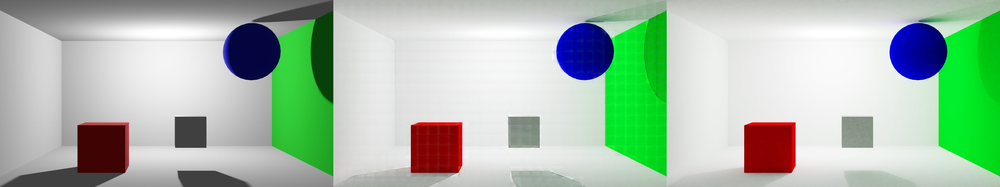
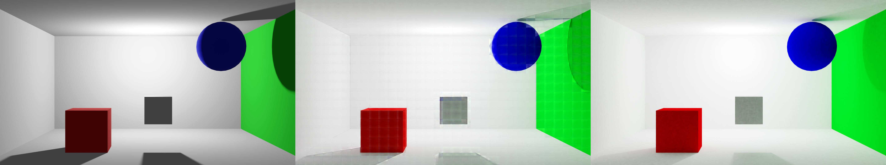
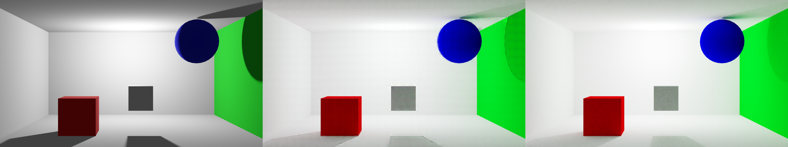

# Kernel Ridge Regression Raytracing
Implementierung der Developer-Gruppe "KRR" eines Kernel Ridge Regression Ansatzes zur Annäherung von Raytracing Rendering.
## Inhaltsverzeichnis
1. [Kurzerklärung von KRR](#info)
2. [Projektaufbau](#aufbau)
    1. [Abhängigkeiten](#abhängigkeiten)
    2. [Dateiaufteilung](#aufteilung)
3. [Developer Team](#team)
4. [Resultate](#result)
<a name="info"></a>
## Kurzerklärung von KRR
Kernel Ridge Regression ist im Grunde eine Kombination aus der [Linearen Regression](https://de.wikipedia.org/wiki/Lineare_Regression),
[L2-Regularisierung](https://en.wikipedia.org/wiki/Regularization_(mathematics)) und dem [Kernel-Trick](https://en.wikipedia.org/wiki/Kernel_method).
Grundlegend wird versucht durch Anwendung von Kernel-Methoden eine Lineare Regression durch einen Datensatz durchzuführen, wobei die Regularisierung 
durch den L2-Ansatz realisiert wird.
<a name="aufbau"></a>
## Projektaufbau
Grundsätzlich besteht das Modell aus drei Bestandteilen. Angefangen mit der Normalisierung des Datensatzes, 
gefolgt von der Anwendung eines Linearen Kernels zur "hochdimensionierung". Zuletzt folgt eine Lineare Regression der Daten. Das Projekt wurde mit verschiedenen Ansätzen getestet. So wurde einerseits von direkter Beleuchtung auf indirekte Beleuchtung mittels eines vorgegebene inneren Bereichs geschlossen. Andererseits durch einen äußeren vorgegeben Bereich.
<a name="abhängigkeiten"></a>
### Abhängigkeiten
Das Projekt wird durch das [Falkon Framework](https://github.com/FalkonML/falkon) realisiert, welches für Mulit-GPU Usage optimiert wurde. Falkon kann durch Optimierungen und Annäherungen einen Performace-Vorteil gegenüber anderen Ansätzen verschaffen.
<a name="aufteilung"></a>
### Dateiaufteilung
Das Projekt wird in vier Teile geteilt. Das KRR-Modell wird einerseits durch ein Python-Script erstellt, dann durch ein anderes trainiert und zuletzt kann das trainierte Modell durch ein weiteres Script abgerufen und verwendet werden.
<a name="result"></a>
## Resultate
Die Resultate sind in zwei Bilder je folgender Kategorie und jeweils in drei Subbilder aufgeteilt. Die beiden Bilder je Kategorie stehen für ein Bild aus dem Trainingsdatensatz und einem aus einem Testdatensatz, den das Modell noch nicht kennt. Diese Bilder enthalten wiederum drei Bilder, die für direkte Beleuchtung *(links)*, globale Beleuchtung des Modells *(mitte)* und tatsächliche globale Beleuchtung durch Blender *(rechts)* stehen.

Die Modelle wurden mit folgenden Parametern trainiert:
```
M                           = 20000
Kernel                      = LaplacianKernel()
Sigma                       = 43000
Regularisierung             = 9e-9
Anzahl Traingsquadranten    = 37440
```
Diese Parameter wurden nicht verbessert und ein Hypertuning könnte diese Parameter verbessern.
### Erster Versuch (Schätzung der globalen Beleuchtung anstatt der indirekten Beleuchtung):
Beschreibung | Bilder
------ | ------
Ablauf| 
Trainingsbild| 
Testbild| 

### Innere Vorgabe:
Beschreibung | Bilder
------ | ------
Ablauf| 
Trainingsbild| 
Testbild| 

### Äußere Vorgabe:
Beschreibung | Bilder
------ | ------
Ablauf| 
Trainingsbild| 
Testbild| 

<a name="team"></a>
## Developer Team
Tjark Prokoph, Niclas Zeiss und Fynn Thiem
